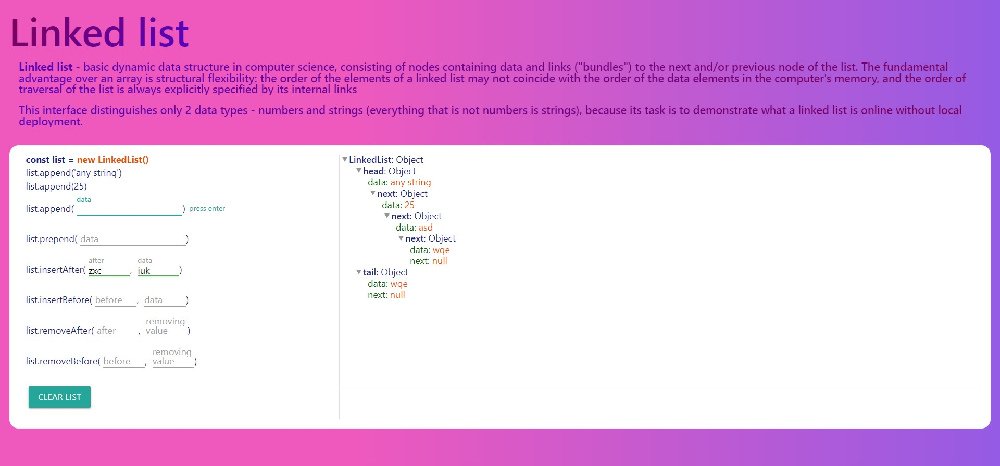

# Linked list

Type: personal practice\

I studied data types on node.js and decided to make a simple interface and upload it to github for clarity.

I paid almost no attention to the interface due to time savings. the goal was to master the linked list, so I didn’t deal with adaptive and cross-browser compatibility, I just added a few styles and visualized the methods and the linked list, which would be pretty. It also accepts only 2 data types from the interface: strings and numbers (everything that is not numbers is strings).

[Watch life](https://artyommusin.github.io/linked-list/)

